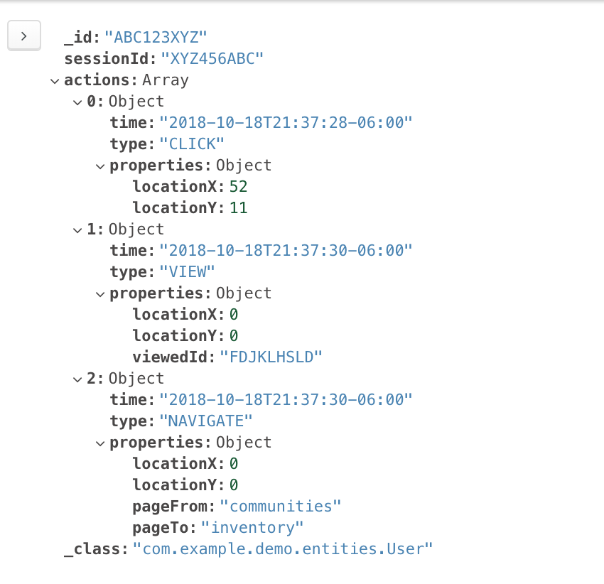

# OpenHouseAICodeTesting
Spring Boot App for doing OpenHouse.AI Code Interview

### Problem Description

Create a Spring Boot app, Flask app, or use a similar framework that you prefer, as a RESTful Web Service to consume, store, and process logs from a frontend application and to make the stored logs retrievable for batch processing.

The FE will be sending logs every 5 minutes from up to 100 users. The logs will need to be retrieved in large volumes on a weekly basis for batch processing. A sample log is available in this folder. The logs should be retrievable by any combination of user, time range and log type. The response should be a list of logs

### Problem Solutions: 

1. Should construct some entities: 

    a. Users: userId, sessionId, actions

    b. Actions: time, type, properties

    c. Properties: locationX, locationY, viewId, pageFrom, pageTo

2. Restful API (Put, `Post`, `Delete`, `Get`), for safety, I will not implement the PUT request

3. Database: `MongoDB`

4. Testing: `Postman`, and `MongoDB Compass`

### Solution Details:

1. Database, it has been hold on my database (MongoDB), so you do not need setup the database

2. URL: `localhost:8080/rest`

3. Post: add the JSON format on the URL: localhost:8080/rest

4. GET: 

    a. Get all: `localhost:8080/rest`
    
    b. Get one: `localhost:8080/rest/'userId'`
    
5. Delete: `localhost:8080/rest/'userId'`

### Additional Problem: 
    The logs should be retrievable by any combination of user, time range and log type. The response should be a list of logs.
    
 #### Solution: 
    1. Since all the actions should be retrievals, I will implement the GET APIs on this. 
    2. Optimizing the database and adding the indexes for the Users, Types, and Logs. 
    3. Writing the queries in the Restful API in different combinations such as (User, Time), (User, Type), (Time, Type), etc.
    4. Testing the code. 

### How to run: 
    
    Before you run it, please make sure your port: 8080 is clear
    command on the the main reposiroty in Terminal: 
    
    $ mvn spring-boot:run

